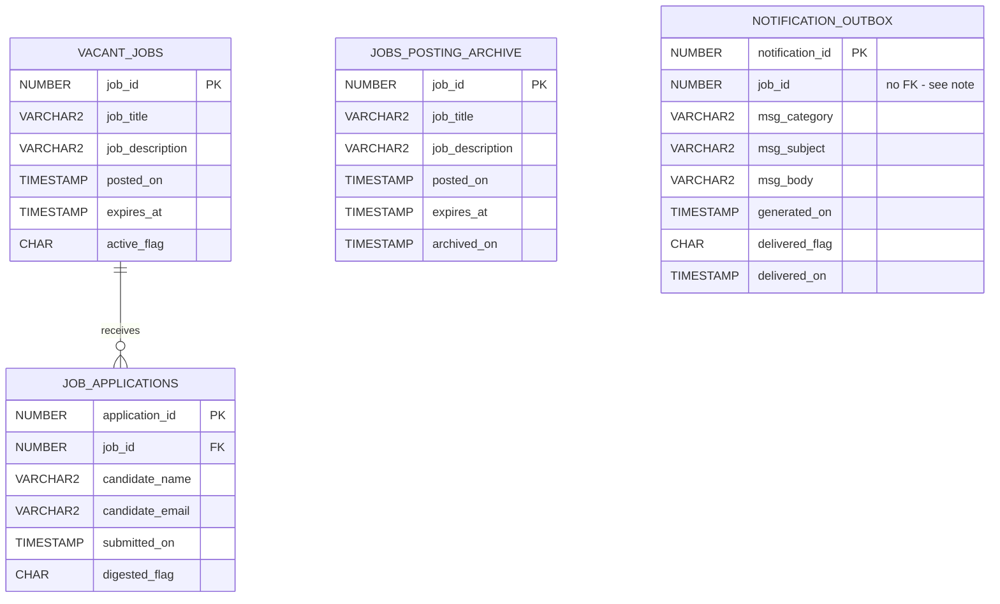

# ERD — The Vacancy Loop

## Design notes (one line each, for the defense)

- **`JOBS_POSTING_ARCHIVE` has no FK back to `VACANT_JOBS`.** It's a historical copy taken at the moment a posting is purged; by definition the source row is gone a moment later, so a live FK would be pointless (and would break the delete).
- **`NOTIFICATIONS.job_id` is a plain column, not a foreign key.** A notification can still be sitting unsent when its posting gets archived and purged (steps 08/09 run every minute; the consumer might not have drained the queue yet). A hard FK would make the purge job fail with an integrity-constraint error the moment that happens. We keep `job_id` for traceability but don't enforce it.
- **`JOB_APPLICATIONS.job_id` is a real FK to `VACANT_JOBS`, `ON DELETE CASCADE`.** Applications only make sense while their posting is live. Once a posting is purged from `VACANT_JOBS` (already archived), its applications go with it rather than becoming orphan rows with no parent to join to.
- Cardinality: one `VACANT_JOBS` row → many `JOB_APPLICATIONS` rows (many candidates can apply to the same posting; not every posting gets an application).
- **`JOB_APPLICATIONS.digested_flag`** marks whether an application has already been counted into a daily-digest notification. Without it, running `send_daily_application_digest` twice would count the same application twice - this flag is what makes that procedure safe to run any number of times.
